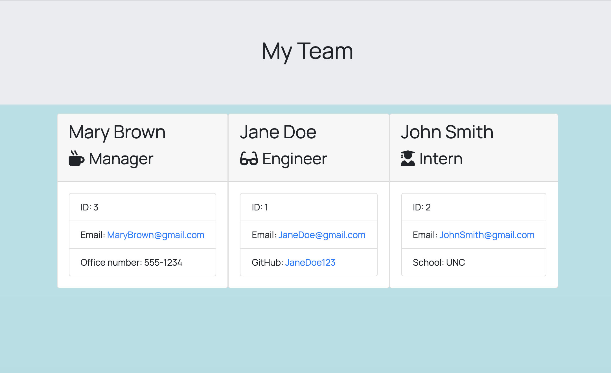

# TemplateEngine-EmployeeSummary

## Description
    This projects generates a team member page with all memebers of a team and different elements about then depending on their team role. Click on the photo below to see a demo of the app.

## User Story
    As a manager
    I want to generate a webpage that displays my team's basic info
    so that I have quick access to emails and GitHub profiles

## Installation
     This app requires inquirer. use the 'npm i' command to install.

## License
    none

## Tests
    run 'npm run test' command for tests